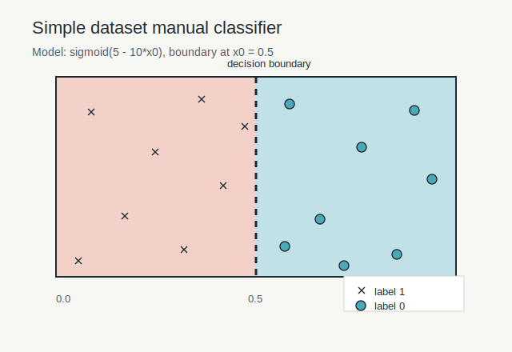

# MiniTorch Module 0


* Docs: https://minitorch.github.io/

* Overview: https://minitorch.github.io/module0/module0/

## Module 0 Visualization

The manual Module 0 model is initialized to split the `Simple` dataset with
the linear classifier:

```text
output = sigmoid(5.0 - 10.0 * x0 + 0.0 * x1)
```

Parameters used in `project/run_manual.py`:

```text
linear.weight_0_0 = -10.0
linear.weight_1_0 = 0.0
linear.bias_0 = 5.0
```

This places the decision boundary at `x0 = 0.5`, matching the dataset rule
`label = 1 if x0 < 0.5 else 0`.


