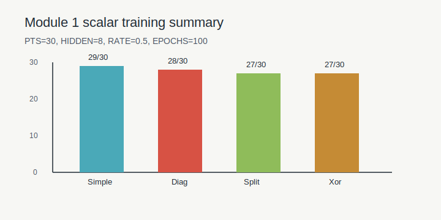

# MiniTorch Module 1


* Docs: https://minitorch.github.io/

* Overview: https://minitorch.github.io/module1/module1/

This assignment requires the following files from the previous assignments. You can get these by running

```bash
python sync_previous_module.py previous-module-dir current-module-dir
```

The files that will be synced are:

        minitorch/operators.py minitorch/module.py tests/test_module.py tests/test_operators.py project/run_manual.py

## Module 1 Training

Local scalar training run used the following reproducible configuration:

```text
PTS=30
HIDDEN=8
RATE=0.5
EPOCHS=100
```

Final logs:

| Dataset | Final epoch | Loss | Correct |
| --- | ---: | ---: | ---: |
| Simple | 100 | 4.3593 | 29/30 |
| Diag | 100 | 2.9177 | 28/30 |
| Split | 100 | 7.0765 | 27/30 |
| Xor | 100 | 5.2706 | 27/30 |


