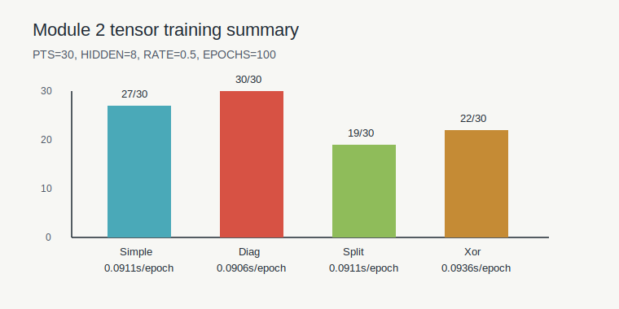

# MiniTorch Module 2


* Docs: https://minitorch.github.io/

* Overview: https://minitorch.github.io/module2/module2/

This assignment requires the following files from the previous assignments. You can get these by running

```bash
python sync_previous_module.py previous-module-dir current-module-dir
```

The files that will be synced are:

        minitorch/operators.py minitorch/module.py minitorch/autodiff.py minitorch/scalar.py minitorch/module.py project/run_manual.py project/run_scalar.py

## Module 2 Training

Local tensor training run used the following reproducible configuration:

```text
PTS=30
HIDDEN=8
RATE=0.5
EPOCHS=100
```

Final logs:

| Dataset | Final epoch | Loss | Correct | Seconds / epoch |
| --- | ---: | ---: | ---: | ---: |
| Simple | 100 | 3.4750 | 27/30 | 0.0911 |
| Diag | 100 | 0.6926 | 30/30 | 0.0906 |
| Split | 100 | 18.0863 | 19/30 | 0.0911 |
| Xor | 100 | 17.5555 | 22/30 | 0.0936 |


